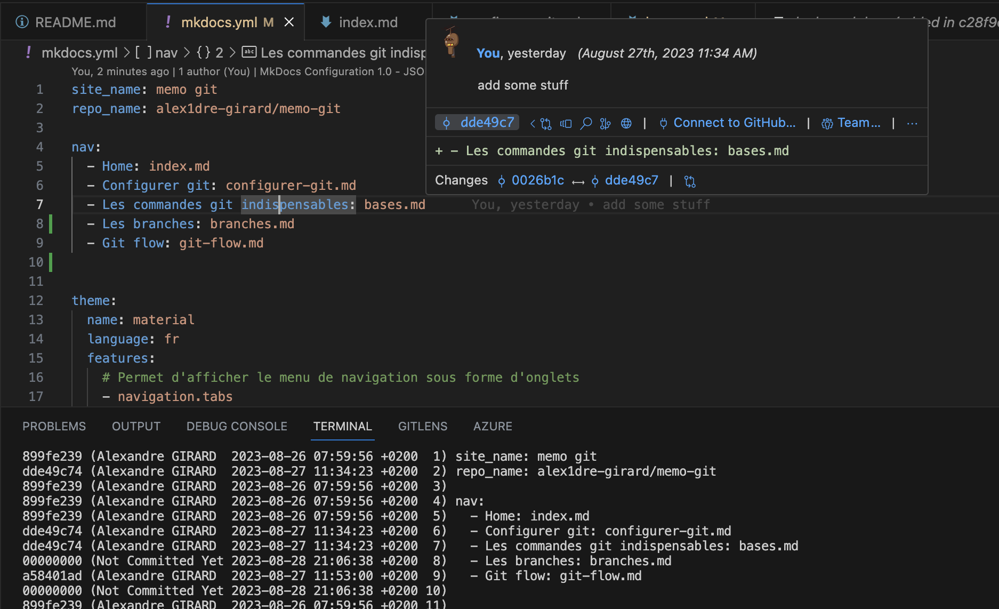
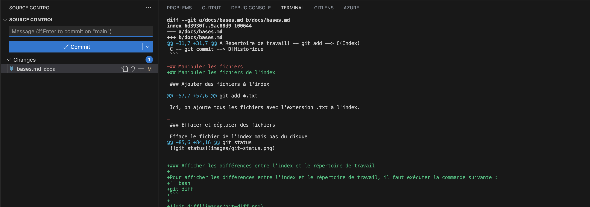
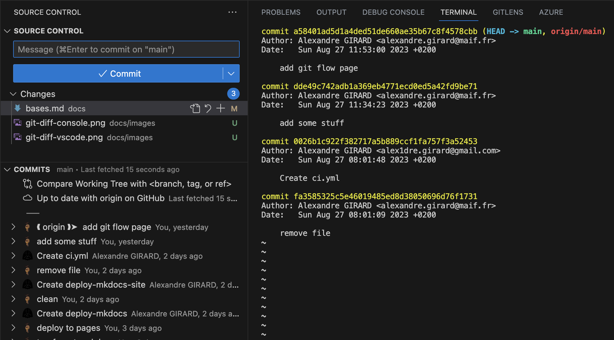

## blame - Identifier l'auteur d'une ligne de code

Pour identifier l'auteur d'une ligne de code, il faut exécuter la commande suivante :
```bash
git blame <file>
```

Cela permet de voir qui a modifié une ligne de code et à quel moment. Cela peut être utile pour identifier l'auteur d'un bug.
Dans Visual Studio Code, il est possible d'afficher les informations de git blame en survolant une ligne de code.



<!-- ## chery-pick - Appliquer un commit sur une autre branche

La commande `git cherry-pick` permet d'appliquer un commit d'une branche sur une autre branche. Cette commande est utile pour appliquer un commit sur une branche sans fusionner la branche. 

Le `cherry-pick` est un outil puissant mais qui peut être dangereux. Il est donc important de bien comprendre son fonctionnement avant de l'utiliser.
Elle possède de nombreux cas d’usages : appliquer une modification commitée sur une mauvaise branche, récupérer un bugfix depuis une branche pour l’appliquer à une autre…

Pour utiliser la commande `git cherry-pick`, il faut se placer sur la branche sur laquelle on souhaite appliquer le commit. Il faut ensuite utiliser la commande `git cherry-pick` suivie du hash du commit à appliquer.

```bash
git cherry-pick 5f4a4b2
```

Cette commande applique le commit `5f4a4b2` sur la branche courante. Le commit `5f4a4b2` n'est pas supprimé de la branche d'origine. Il est donc possible de l'appliquer sur plusieurs branches.

```mermaid
gitGraph
       commit
       branch develop
       commit
       checkout main
       commit
       checkout develop
       commit id:"3-5f4a4b2"
       checkout main
       commit
       cherry-pick id:"3-5f4a4b2"
       commit
       checkout develop
       commit
``` -->

## diff - Afficher les différences

Pour afficher les différences entre l'index et le répertoire de travail, il faut exécuter la commande suivante :
```bash
git diff
```



Il est possible d'afficher les différences entre l'index et le répertoire de travail pour un fichier en particulier avec la commande suivante :
```bash
git diff <file>
```

Il est possible de voir ces différences directement dans l'ide. Par exemple, avec Visual Studio Code, il suffit de cliquer sur le fichier dans l'onglet source control.


Pour afficher les différences entre l'index et le dernier commit, il faut exécuter une des commandes suivantes :
```bash
git diff --cached
git diff HEAD
```

Pour afficher les différences entre deux commits, il faut exécuter la commande suivante :
```bash
git diff <commit1> <commit2>
```

Par exemple pour afficher la différence entre le dernier commit et l'avant dernier commit, il faut exécuter la commande suivante :
```bash
git diff HEAD HEAD^
```
## log - Afficher l'historique des commits

Pour afficher l'historique des commits, il faut exécuter la commande suivante :
```bash
git log
```

Il est possible de filtrer l'historique des commits avec différentes options. 

Par exemple, pour afficher les 3 derniers commits, on peut exécuter la commande suivante :
```bash
git log -n 3
```



Pour afficher les commits d'une période :
```bash
git log --since="2022-01-01" --until="2022-12-31"
```

Pour afficher les commits d'un fichier :
```bash
git log -- <file>
```

Les options de filtrage peuvent être combinées. Par exemple, pour afficher les 3 derniers commits d'un utilisateur sur un fichier :
```bash
git log --author="John Doe" -n 3 -- <file>
```

## reset - Annuler un commit

Il est possible d'annuler le dernier commit avec la commande suivante :
```bash
git reset --soft HEAD^
```

Si l'on souhaite annuler le dernier commit et supprimer les fichiers de l'index, il faut exécuter la commande suivante :
```bash
git reset --hard HEAD^
```

Le caractère ^ signifie le commit précédent. Il est possible d'annuler plusieurs commits en ajoutant plusieurs ^. Il est aussi possible d'utilisé le charactère ~ pour annuler plusieurs commits. Par exemple, pour annuler les 3 derniers commits, il faut exécuter la commande suivante :
```bash
git reset --soft HEAD~3
```

## revert - Annuler un commit publié

Il est possible d'annuler un commit publié avec la commande suivante :
```bash
git revert <commit>
```

## stash - Mettre de côté des modifications

La commande `git stash` permet de sauvegarder les modifications en cours de développement. Cette commande est utile pour sauvegarder les modifications en cours de développement sans avoir à créer une branche.

Pour utiliser la commande `git stash`, il faut se placer sur la branche sur laquelle on souhaite sauvegarder les modifications. Il faut ensuite utiliser la commande `git stash`.

```bash
git stash
```

Il est possible de donner un nom à la modification sauvegardée en utilisant l'option `-m`, afin de pouvoir la retrouver plus facilement.

```bash
git stash -m "Modification en cours"
```

Cette commande sauvegarde les modifications en cours de développement. Les modifications sont sauvegardées dans une pile. Il est possible de sauvegarder plusieurs modifications.

Pour lister les modifications sauvegardées, il suffit d'utiliser la commande `git stash list`.

```bash
git stash list
```

Pour appliquer une modification sauvegardée, il suffit d'utiliser la commande `git stash apply` suivie du numéro de la modification ou de son nom.

```bash
git stash apply stash@{0}

git stash apply "Modification en cours"
```

Cette commande applique la modification `stash@{0}` sur la branche courante. La modification `stash@{0}` n'est pas supprimée. Il est donc possible de l'appliquer sur plusieurs branches.

Pour supprimer une modification sauvegardée, il suffit d'utiliser la commande `git stash drop` suivie du numéro de la modification.

```bash
git stash drop stash@{0}
```

Il est aussi possible de supprimer toutes les modifications sauvegardées en utilisant la commande `git stash clear`.

```bash
git stash clear
```

## tag - Marquer un commit

Les tags permettent de marquer un commit. Ils sont utiles pour marquer les versions d'un projet. Ils sont, par exemple, très utiles pour marquer les versions de production.

Pour créer un tag, il suffit d'utiliser la commande `git tag` suivie du nom du tag et du hash du commit à marquer.

```bash
git tag v1.0.0 5f4a4b2
```

Cette commande crée un tag nommé `v1.0.0` sur le commit `5f4a4b2`.

L'option `-m` permet de donner un nom au tag.

```bash
git tag -m "Version 1.0.0" v1.0.0 5f4a4b2
```

Pour lister les tags, il suffit d'utiliser la commande `git tag`.

```bash
git tag
```

Cette commande affiche la liste des tags du projet.

```bash
v1.0.0
v1.1.0
v2.0.0
```

```mermaid
gitGraph
       commit
       commit id: "2-5f4a4b2" tag: "v1.0.0"
       commit
       commit tag: "v1.1.0"
       commit
       commit tag: "v2.0.0"
       commit
```
## Références

- [Git cherry-pick](https://git-scm.com/docs/git-cherry-pick)
- [Git stash](https://git-scm.com/book/en/v2/Git-Tools-Stashing-and-Cleaning)
- [Git tag](https://git-scm.com/book/en/v2/Git-Basics-Tagging)